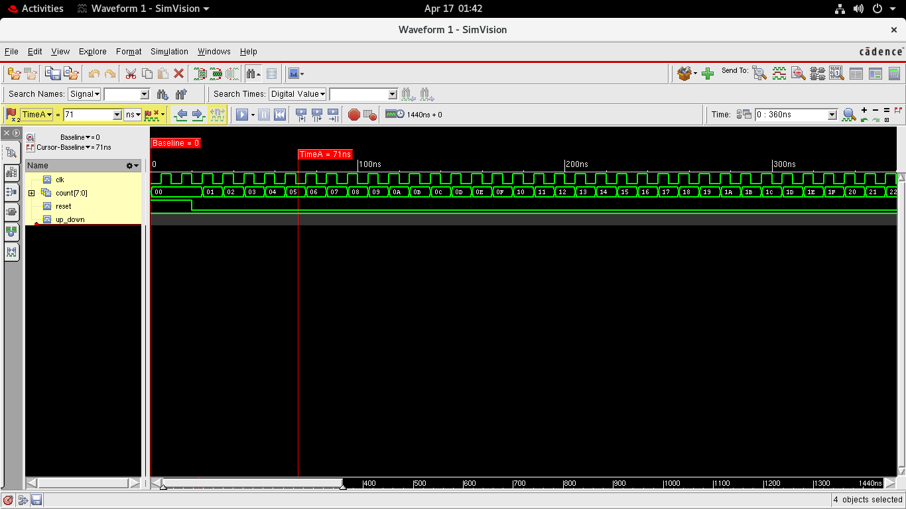
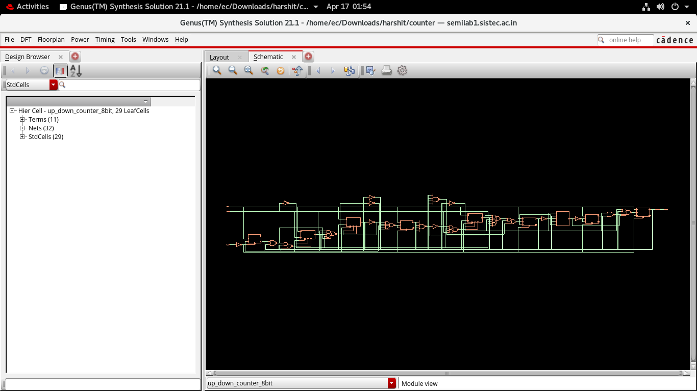

# 8-Bit Synchronous Up/Down Counter: RTL-to-GDSII Flow

## 📌 Project Overview
This repository contains the complete ASIC design flow for an 8-bit Synchronous Up/Down Counter. The project was driven from behavioral RTL through logic synthesis and into physical design (layout) using industry-standard Cadence EDA tools and a TSMC 180nm technology node.

This project serves as a foundational proof-of-concept for executing a complete Digital VLSI front-end and back-end workflow.

## 🛠️ Tools & Technology
* **Technology Node:** TSMC 180nm (slow corner library for worst-case analysis)
* **Simulation & Verification:** Cadence Xcelium (`xrun`) & SimVision
* **Logic Synthesis:** Cadence Genus
* **Physical Design (PnR):** Cadence Innovus

## 🏗️ Design Specifications
* **Architecture:** 8-Bit Synchronous Counter
* **Features:** Up/Down directional control, asynchronous reset, clock-synchronous state updates.
* **Target Clock Frequency:** 100 MHz (10ns Period)

## 📈 Functional Verification
The behavioral logic was verified using a Verilog testbench simulated in Cadence Xcelium. The resulting waveforms were analyzed in SimVision to ensure proper up/down counting and reset functionality.

*(Simulation waveform showing the clock, reset, up/down control, and 8-bit count output)*
 

## 📊 Synthesis Results (Sign-Off Metrics)
After mapping the RTL to the TSMC 180nm standard cell library in Cadence Genus, the design achieved the following metrics:
* **Total Standard Cells:** 25 (Optimized primarily using JK-Flip Flops and Complex AOI/OAI gates).
* **Total Area:** 924.74 µm²
* **Setup Timing Slack:** +6.05 ns (MET)
* **Total Power Consumption:** 74.4 µW (89% sequential register power).

*(Gate-level schematic generated by Cadence Genus post-synthesis)*

## 🖼️ Physical Design (Layout)
The synthesized gate-level netlist was imported into Cadence Innovus for Physical Design. 
* **Floorplanning:** Core boundary defined with standardized row placement.
* **Power Delivery Network (PDN):** Metal 4 (Vertical Stripes) and Metal 1 (Horizontal Rails) forming a robust VDD/VSS mesh.
* **Routing:** Signal routing completed using NanoRoute strictly adhering to Metal 2 (Vertical) and Metal 3 (Horizontal) preferred routing directions.

*(Final routed layout from Cadence Innovus)*

## 📂 Repository Structure
* `/src`: Contains the behavioral Verilog RTL.
* `/tb`: Contains the simulation testbench.
* `/netlist`: Contains the Genus synthesized gate-level netlist and SDC constraints.
* `/reports`: Contains the raw area, power, and timing reports from Genus.
* `/images`: Screenshots of SimVision waveforms, Genus schematics, and Innovus layout.

## 🚀 How to Run (Cadence Environment Required)
1. **Simulation:** `xrun src/up_down_counter_8bit.v tb/tb_up_down_counter.v -access +rwc`
2. **Synthesis:** Load `netlist/counter_constraints.sdc` and `src/up_down_counter_8bit.v` into Cadence Genus using `syn_map`.
